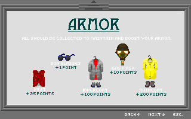

# IslandPerilExtractor

IslandPerilExtractor is a tool designed to extract and process resources from `.ipw` files, specifically for the game "Island Peril". It can extract files embedded in the `.ipw` archive and process `.PIC` image files to generate PNG images.

## Features

- Extracts files from `.ipw` archives.
- Processes `.PIC` image files to generate PNG images.
- Supports parallel processing for faster image conversion.
- Handles transparency in `.PIC` images and saves both regular and transparent versions.

## Requirements

- .NET 9.0 or later.
- [SixLabors.ImageSharp](https://github.com/SixLabors/ImageSharp) library for image processing.

## Usage

1. Build the project using .NET 9.0 or later.
2. Either drop the `.ipw` file onto the exe, or run the application with the following command:

   ```bash
   IslandPerilExtractor <ipw file> 
   ```

   - `<ipw file>`: Path to the `.ipw` file to extract.

## Example

```bash
IslandPerilExtractor C:\path\to\file.ipw
```

This will extract the contents of `file.ipw` to `C:\path\to\extracted_resources` and process any `.PIC` files found.

## Output Examples

Below are some examples of the PNG files generated by the application, located in the `examples` folder:

- `ARMOR_199_160_8.png`
  

- `EFWALK1_98_19_7.png`
  

- `PISTL0_93_25_7.png`
  

- `PSCHFFRA_115_47_7.png`
  

## Notes

- The output PNG files will be saved in a subdirectory named `pic_output` within the output directory.
- Transparent versions of the `.PIC` images will be saved in a subdirectory named `transparent_output` within the output directory.

## License

This project is licensed under the MIT License. See the LICENSE file for details.
